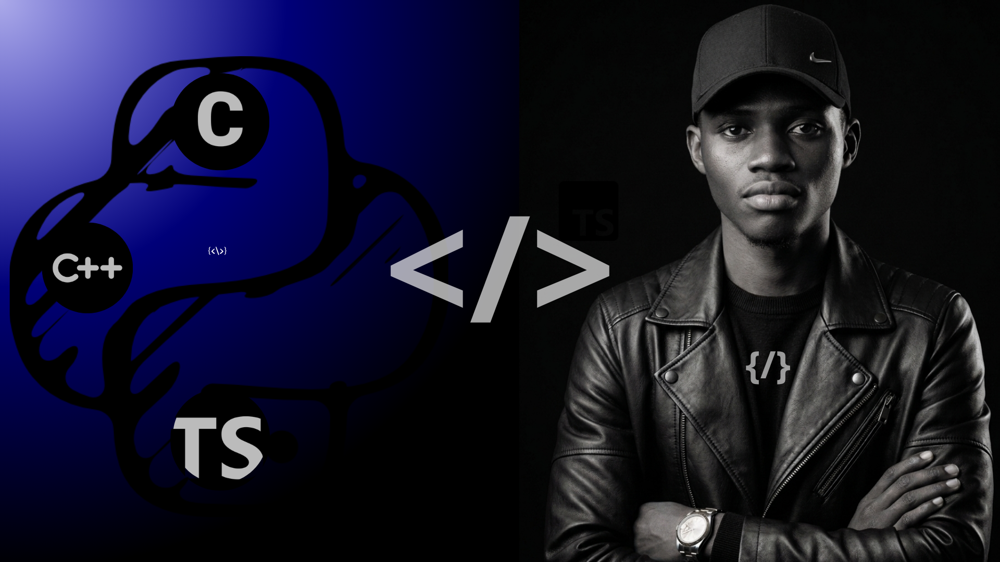

 

  <strong>Software Engineer | DevOps | SEO</strong> 
  A construir soluções modernas, elegantes e com impacto real.

  

---

## Sobre mim

Sou **Arnaldo de Melo**, Software Engineer focado em transformar ideias em produtos simples, sólidos e escaláveis.
Trabalho entre **front-end, back-end, DevOps e SEO técnico**, com atenção a performance, experiência e manutenção.

Gosto de construir com intenção: menos ruído, mais clareza, mais valor.

---

## Foco

  <table align="center" cellpadding="12" cellspacing="2" border="1" bordercolor="#1F2937" width="92%">
    <tr>
      <td width="33%" valign="top" bgcolor="#0B1120" align="center">
        <strong>Produto</strong> 
        Interfaces claras com Vue.js, Next.js e React.
      </td>
      <td width="33%" valign="top" bgcolor="#0B1120" align="center">
        <strong>Backend</strong> 
        APIs e sistemas com Nest.js, Node.js, Django e Flask.
      </td>
      <td width="33%" valign="top" bgcolor="#0B1120" align="center">
        <strong>Cloud & SEO</strong> 
        Docker, AWS, GitHub Actions e performance para web.
      </td>
    </tr>
  </table>

---

## Soft Skills

- Comunicação clara
- Ownership
- Trabalho em equipa
- Pensamento crítico
- Adaptabilidade

---

## Stack

### Linguagens

  
  
  
  
  

### Frontend

  
  
  
  
  
  

### Backend

  
  
  
  
  

### Cloud, DevOps e Ferramentas

  
  
  
  
  

### Inteligência Artificial

  
  
  
  

---

## Em tempo real

  

<!-- AUTO:REALTIME_STATS_START -->

  <table align="center" cellpadding="10" cellspacing="2" border="1" bordercolor="#1F2937" width="92%">
    <tr>
      <td align="center" width="25%" bgcolor="#0B1120"><strong>Repos públicos</strong> 6</td>
      <td align="center" width="25%" bgcolor="#0B1120"><strong>Commits este mês</strong> 14</td>
      <td align="center" width="25%" bgcolor="#0B1120"><strong>Linguagem dominante</strong> TypeScript</td>
      <td align="center" width="25%" bgcolor="#0B1120"><strong>Último projeto</strong> <a href="https://github.com/arnaldo-de-melo-dev99/Goals-Plane">Goals-Plane</a></td>
    </tr>
  </table>

<!-- AUTO:REALTIME_STATS_END -->

---

## Projetos

> Os projectos abaixo são actualizados automaticamente e aparecem do mais recente para o mais antigo.

<!-- AUTO:PROJECTS_START -->

<table align="center" cellpadding="12" cellspacing="2" border="1" bordercolor="#1F2937" width="92%">
  <tr>
    <td width="50%" valign="top" bgcolor="#0B1120">
      
      <h3><a href="https://github.com/arnaldo-de-melo-dev99/Goals-Plane">Goals-Plane</a></h3>
      
Plataforma digital para planear e organizar objectivos pessoais, com uma experiência visual simples e intuitiva, à maneira de um Trello.

      
<strong>Techs:</strong> TypeScript • HTML • JavaScript • CSS

    </td>
    <td width="50%" valign="top" bgcolor="#0B1120">
      
      <h3><a href="https://github.com/arnaldo-de-melo-dev99/event-connect">event-connect</a></h3>
      
Projecto em TypeScript e CSS em evolução, preparado para crescer com uma base limpa e moderna.

      
<strong>Techs:</strong> TypeScript • CSS

    </td>
  </tr>
  <tr>
    <td width="50%" valign="top" bgcolor="#0B1120">
      
      <h3><a href="https://github.com/arnaldo-de-melo-dev99/DS-CEP">DS-CEP</a></h3>
      
Ferramenta prática para consulta de CEP em JavaScript, HTML e CSS, com uma interface directa.

      
<strong>Techs:</strong> JavaScript • CSS • HTML

    </td>
    <td width="50%" valign="top" bgcolor="#0B1120">
      
      <h3><a href="https://github.com/arnaldo-de-melo-dev99/Note-Pad">Note-Pad</a></h3>
      
Aplicação de notas em React e Tailwind CSS, pensada para capturar ideias com rapidez e clareza.

      
<strong>Techs:</strong> TypeScript • HTML • JavaScript • CSS

    </td>
  </tr>
  <tr>
    <td colspan="2" valign="top" bgcolor="#0B1120">
      
      <h3><a href="https://github.com/arnaldo-de-melo-dev99/Web-site-MarketPLace">Web-site-MarketPLace</a></h3>
      
Marketplace de produtos digitais em fase inicial, com base para evoluir em produto e conversão.

      
<strong>Techs:</strong> A definir

    </td>
  </tr>
</table>

<!-- AUTO:PROJECTS_END -->

---

## Objetivos

- Construir produtos mais elegantes e úteis
- Evoluir em Vue.js, Next.js e Nest.js
- Crescer em DevOps, cloud e SEO técnico
- Manter foco em qualidade, clareza e impacto

---

## Contato

  
  
  

