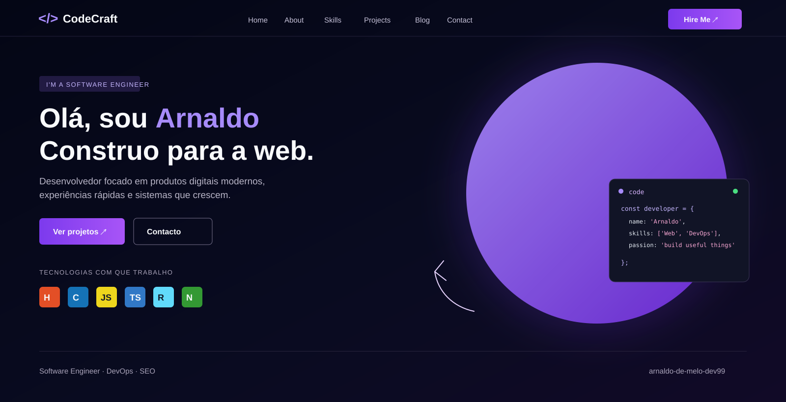

  
    
  
  

---

## Sobre mim

<table>
  <tr>
    <td width="58%" valign="top">
      <h3>Construo soluções digitais com propósito.</h3>
      
Desenvolvedor focado em experiências claras e eficientes. Trabalho entre front-end, back-end, DevOps e SEO técnico, com atenção a performance, manutenção e impacto no produto.

      
<a href="mailto:arnaldodemelo99@gmail.com"><strong>Vamos conversar →</strong></a>

    </td>
    <td width="21%" align="center" valign="middle">
      <strong>Full stack</strong> 
      Web & APIs
    </td>
    <td width="21%" align="center" valign="middle">
      <strong>DevOps</strong> 
      Cloud & entrega
    </td>
  </tr>
</table>

## Stack

<table>
  <tr>
    <td width="50%" valign="top">
      <h3>⌘ Linguagens</h3>
      

        
        
        
        
        
      

    </td>
    <td width="50%" valign="top">
      <h3>◈ Front-end</h3>
      

        
        
        
        
        
        
      

    </td>
  </tr>
  <tr>
    <td width="50%" valign="top">
      <h3>◉ Back-end</h3>
      

        
        
        
        
        
      

    </td>
    <td width="50%" valign="top">
      <h3>☁ Cloud & DevOps</h3>
      

        
        
        
        
        
      

    </td>
  </tr>
  <tr>
    <td colspan="2" valign="top">
      <h3>✦ Inteligência artificial</h3>
      

        
        
        
        <strong>&nbsp; Machine Learning</strong>
      

    </td>
  </tr>
</table>

## GitHub em números

  
  

<!-- AUTO:REALTIME_STATS_START -->

  <strong>9</strong> repositórios públicos &nbsp;•&nbsp; <strong>1</strong> commits este mês &nbsp;•&nbsp; <strong>TypeScript</strong> como linguagem dominante 
  Projeto mais recente: <a href="https://github.com/arnaldo-de-melo-dev99/skills-introduction-to-github">skills-introduction-to-github</a>

<!-- AUTO:REALTIME_STATS_END -->

## Projetos em destaque

Alguns projetos que refletem o meu foco em produtos claros, ferramentas úteis e bases técnicas sólidas.

<!-- AUTO:PROJECTS_START -->
<table>
  <tr>
    <td width="50%" valign="top">
      <h3>01 · <a href="https://github.com/arnaldo-de-melo-dev99/skills-introduction-to-github">skills-introduction-to-github</a></h3>
      
My clone repository

      
<code>A definir</code>

    </td>
    <td width="50%" valign="top">
      <h3>02 · <a href="https://github.com/arnaldo-de-melo-dev99/FileReplace">FileReplace</a></h3>
      
A lightweight C++ utility that reads a text file, replaces all occurrences of a target string with a new one, and generates a new output file while preserving the original content.

      
<code>C++</code> · <code>Makefile</code>

    </td>
  </tr>
  <tr>
    <td width="50%" valign="top">
      <h3>03 · <a href="https://github.com/arnaldo-de-melo-dev99/animate-bash">animate-bash</a></h3>
      
Creating a custom bash shell

      
<code>A definir</code>

    </td>
    <td width="50%" valign="top">
      <h3>04 · <a href="https://github.com/arnaldo-de-melo-dev99/Goals-Plane">Goals-Plane</a></h3>
      
Plataforma digital para planear e organizar objectivos pessoais, com uma experiência visual simples e intuitiva, à maneira de um Trello.

      
<code>TypeScript</code> · <code>HTML</code> · <code>JavaScript</code> · <code>CSS</code>

    </td>
  </tr>
  <tr>
    <td colspan="2" valign="top">
      <h3>05 · <a href="https://github.com/arnaldo-de-melo-dev99/event-connect">event-connect</a></h3>
      
Projecto em TypeScript e CSS em evolução, preparado para crescer com uma base limpa e moderna.

      
<code>TypeScript</code> · <code>CSS</code>

    </td>
  </tr>
</table>
<!-- AUTO:PROJECTS_END -->

---

Vamos criar algo útil? <a href="mailto:arnaldodemelo99@gmail.com">Entre em contacto.</a>

